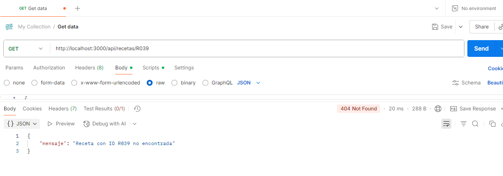
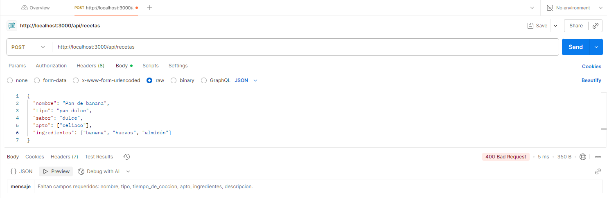
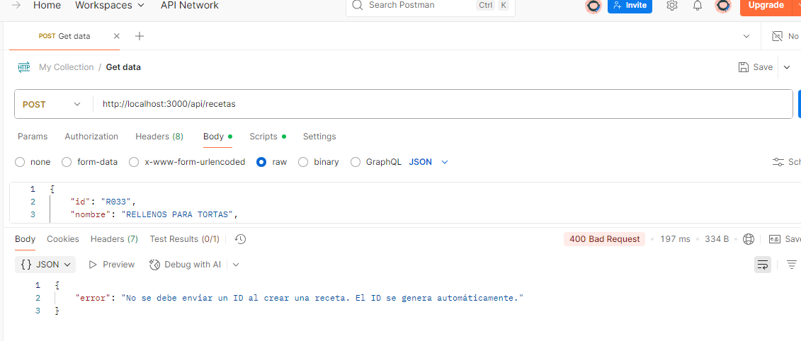
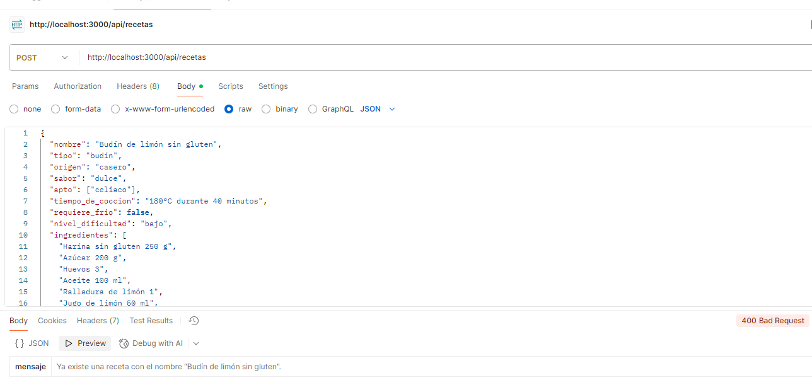

# 🍞🍰 API de Recetas Sin Gluten

API REST creada con **Node.js + Express** que permite gestionar recetas sin gluten.  
Incluye CRUD completo, filtros combinables por query, validaciones y registro de logs.

---

## 1️⃣ Descripción general

### 🧁 Tema elegido y motivo de elección
El tema elegido es una **API de recetas sin gluten**, ya que responde a una necesidad real:  
cada vez más personas buscan opciones aptas para celíacos o con restricciones alimentarias.  
Elegí este tema porque combina mi interés por la **gastronomía y la programación**, permitiendo crear una herramienta útil y escalable.

### ⚙️ Resumen del funcionamiento
La API permite realizar operaciones CRUD sobre un conjunto de recetas sin gluten almacenadas en un archivo JSON:
- **GET:** listar todas las recetas o buscar por filtros.
- **POST:** agregar una nueva receta.
- **PUT:** modificar una receta existente.
- **DELETE:** eliminar una receta.
- **GET (estadisticas):** lista la cantidad de recetas, y las agrupa por tipo, por sabor y por origen.
  
También cuenta con **middlewares personalizados** para validación de datos y registro de logs.

---

## 2️⃣ Arquitectura del proyecto

### 🧱 Función de cada capa

| Capa | Descripción |
|------|--------------|
| **Modelo (models)** | Gestiona la lectura, escritura y manipulación de datos en el archivo `db.json`. |
| **Controlador (controllers)** | Contiene la lógica principal de cada endpoint. Procesa la solicitud y envía la respuesta. |
| **Rutas (routes)** | Define las rutas de la API y las vincula con los métodos del controlador. |
| **Middlewares** | Se ejecutan antes o después de las peticiones. Validan datos, registran logs o controlan el flujo. |

---

## 3️⃣ Endpoints documentados

| Método     | Ruta                           | Descripción                     | Ejemplo de uso |
| ---------- | ------------------------------ | ------------------------------- | --------------- |
| **GET**    | `/api/recetas`                 | Obtener todas las recetas       | `/api/recetas` |
| **GET**    | `/api/recetas/filtro?tipo=pan` | Filtrar combinando query params | `/api/recetas/filtro?apto=celiaco&requiere_frio=false` |
| **GET**    | `/api/recetas/:id`             | Obtener receta por ID           | `/api/recetas/R001` |
| **POST**   | `/api/recetas`                 | Crear nueva receta              | *(ver JSON abajo)* |
| **PUT**    | `/api/recetas/:id`             | Actualizar receta existente     | *(ver JSON abajo)* |
| **DELETE** | `/api/recetas/:id`             | Eliminar receta por ID          | `/api/recetas/R001` |
| **GET**    | `/api/recetas/estadisticas`    | Obtener estadísticas generales  | `/api/recetas/estadisticas` |


### 📦 Ejemplo de body (POST)

```json
{
  "nombre": "Pan de banana",
  "tipo": "pan dulce",
  "tiempo_de_coccion": "50 minutos a 180°",
  "apto": ["celiaco"],
  "ingredientes": ["banana", "huevos", "almidón"],
  "descripcion": "Mezclar todo y hornear 30 min a 180°C"
}
```

---

## 4️⃣ Middlewares implementados

| Middleware          | Función                                                                                               | Momento de ejecución                             |
| ------------------- | ----------------------------------------------------------------------------------------------------- | ------------------------------------------------ |
| **logger.js**       | Registra en consola y en `logs.txt` el método, ruta y fecha de cada solicitud.                        | Antes de cada petición (`app.use(logger)`)       |
| **validateData.js** | Verifica que el cuerpo del request incluya los campos requeridos. Devuelve error 400 si falta alguno. | Antes del controlador en métodos `POST` y `PUT`. |

### Ejemplo de log generado:

`[2025-10-28 14:32:10] POST /api/recetas`

---

## 5️⃣ Validaciones

### ✅ ID formateado

* Los ID se transforman al formato original (R001) para normalizar las búsquedas.

### ✅ Claves normalizadas

* Las claves se normalizan reemplazando los espacios entre palabras por guiones bajos (_).

### ✅ Campos obligatorios

* nombre, tipo, tiempo_de_coccion, apto, ingredientes, descripcion.

### ⚠️ Condiciones verificadas

Ejemplo de error:

Si el ID no existe → Error 404.



Si faltan campos requeridos → Error 400.



Si se le coloca ID al cargar receta → Error 400.



Si el nombre de la receta ya existe → Error 400.



---

## 6️⃣ Ejemplos de uso (Postman)

### 📦 Ejemplo de petición (GET)


### 📦 Ejemplo de petición (GET/ID)


### 📦 Ejemplo de petición (GET/FILTROS)


### 📦 Ejemplo de petición (PUT)


### 📦 Ejemplo de petición (DELETE)


### 📦 Ejemplo de petición (POST)


### 📦 Ejemplo de petición (GET/ESTADISTICAS)


---

## 7️⃣ Conclusión

Durante el desarrollo de este proyecto aprendí a estructurar una API REST de forma modular,
aplicando buenas prácticas como separación en capas, uso de middlewares y manejo de errores.

Una de las principales dificultades fue la implementación de los filtros combinables por query,
ya que requería validar distintos parámetros dinámicos al mismo tiempo.

El resultado final es una API funcional, escalable y con una base sólida para futuras mejoras,
como la incorporación de persistencia con base de datos real o autenticación de usuarios.

---

### 🧑‍💻 Autor:
Proyecto desarrollado por Josefina Ronzani – Programación – 2025.